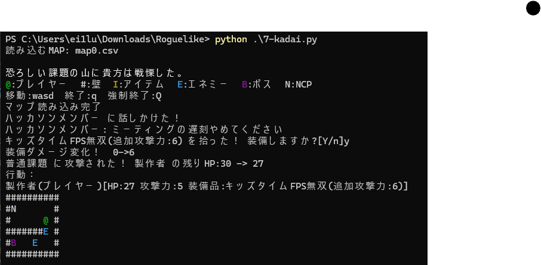

# Roguelike

## 概要

コンソールで動くマップ制作可能のローグライクゲームツール - map makeable roguelike game tool

武蔵野大学 一年次授業制作物

指定：自由



## 遊び方

1. マップファイルを聞かれるのでカレントディレクトリからのファイルのパスで選択する。  
   `(サンプル：map0.csv、map1.csv、map2.csv)`  
   コーデックエラーが出る場合はプログラムの49行末端引数にcsvファイルのエンコードを指定してください。

2. プレイヤーを操作：wasd移動、qで終了、Qで強制終了
   - エネミーやボスにぶつかると攻撃、アイテムにぶつかると取得、npcにぶつかると会話
   - アイテムは取得時にYで装備、その他で処分
   - アイテムは一つしか装備できない。
   - エネミーとボスは前後左右いずれかにプレイヤーがいると攻撃する
   - エネミーは移動することがある。

---

## 作り方

1. 壁を1,空間を0として __それらを反転させてから__ 10進数に変換、これを一ブロックとする。<br>(例：# \_ # \_ # # #\_ \_ \_⇨0001110101⇨117)
2. 以下のようにcsvに配置する。<br>
__※必ずutf-8のエンコードで記述してください__

---

```csv
map.height, map.weight, enemy.sum, item.sum, npc.sum, OPmessage, EDmessage, GameoverMessage
0行目ブロック羅列
1行目ブロック羅列・・・(yの数だけ繰り返す)
pl.y, pl.x, pl.HP, pl.attackPoint, pl.name
boss.y, boss.x, boss.HP, boss.attackPoint, boss.name
enemy1.y, enemy1.x, enemy1.HP, enemy1.attackPoint, enemy1.name・・・(ene.sumの数だけ繰り返す)
item1.y, item1.x, item1.power, item1.name・・・(item.sumの数だけ繰り返す)
npc1.y, npc1.x, npc1.serif, npc1.name・・・(npc.sumの数だけ繰り返す)
```
